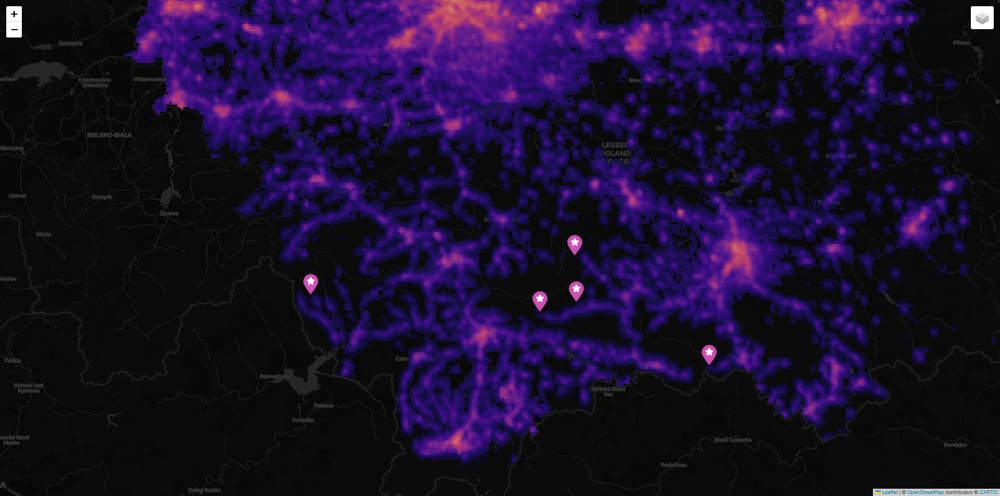

# AstroGIS: Optimal Observation Site Discovery Engine

[](https://www.python.org/downloads/)
[](https://opensource.org/licenses/MIT)

AstroGIS is a geospatial analysis tool designed to identify the best astronomical observation sites in any given region. By combining **satellite radiance data (VIIRS)**, **topographic elevation (DEM)**, and **administrative boundaries (OSM)**, the engine calculates a proprietary "Observation Quality Index" to rank locations for amateur and professional astronomers.



## Key Features

- **Automated GIS Pipeline:** Downloads regional boundaries directly from OpenStreetMap via `OSMnx`.
- **Radiance Processing:** Processes NASA/NOAA VIIRS Nighttime Lights data with `Rasterio` and `GeoPandas`.
- **Bortle Scale Mapping:** Automatically classifies light pollution levels into the industry-standard Bortle Dark-Sky Scale.
- **Elevation Integration:** Utilizes the Open-Meteo API to fetch real-time elevation data for top-tier candidates to factor in atmospheric thickness.
- **Multimodal Visualization:** Generates static heatmaps (`Matplotlib`) and interactive web maps (`Folium`) with custom log-scaled radiance overlays.

##  Tech Stack

- **Languages:** Python
- **GIS Libraries:** GeoPandas, Rasterio, Shapely, OSMnx
- **Data Analysis:** NumPy, Pandas
- **Visualization:** Folium (Leaflet.js wrapper), Matplotlib
- **APIs:** Open-Meteo (Elevation), OpenStreetMap (Overpass)

## Methodology

The project uses a weighted ranking algorithm to evaluate potential sites:
1. **Light Suppression:** Raw radiance values are masked and log-transformed to highlight subtle differences in dark areas.
2. **Topographic Filtering:** Candidate spots are cross-referenced with elevation data. Higher altitude reduces atmospheric scattering (seeing).
3. **Quality Score Formula:** $$Score = \frac{1}{Radiance + 0.1} \times \frac{Elevation}{100}$$


## Installation & Usage

1. **Clone the repository:**
   ```bash
   git clone [https://github.com/Retunse/light-pollution-analysis.git](https://github.com/Retunse/light-pollution-analysis.git)
   cd light-pollution-analysis
